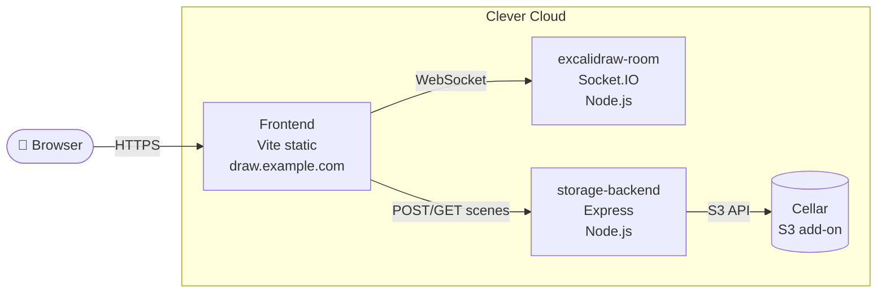

# Self-host Excalidraw on Clever Cloud

End-to-end guide to deploy your own Excalidraw stack — editor, real-time collaboration, and scene storage — on Clever Cloud.

Two deployment paths covered in parallel: `clever` CLI for hands-on learning, **and** Terraform for reproducibility.

## Architecture



Three Clever Cloud apps + one add-on:

| Component | Source                              | CC runtime    | Add-ons |
|-----------|-------------------------------------|---------------|---------|
| frontend  | fork of `excalidraw/excalidraw`     | static        | —       |
| room      | fork of `excalidraw/excalidraw-room`| Node.js       | —       |
| storage   | written here                        | Node.js       | Cellar  |

## Repo layout

```
clever_projects/excalidraw/
├── README.md
├── docs/
│   ├── tutorials/       ← step-by-step procedures (read in order)
│   └── notions/         ← conceptual explanations (read as needed)
├── frontend/            ← clone of your fork (or symlink)
├── room/                ← clone of your fork (or symlink)
├── storage/             ← we build this
└── terraform/           ← reproducible infra
```

## Tutorials (do this)

1. [00 — Prerequisites](docs/tutorials/00-prerequisites.md) — tools + accounts
2. [01 — Fork & clone](docs/tutorials/01-fork-and-clone.md) — repo strategy + upstream tracking
3. [02 — Storage backend](docs/tutorials/02-storage-backend.md) — custom Node + Cellar
4. [03 — Collaboration room](docs/tutorials/03-collaboration-room.md) — Socket.IO server
5. [04 — Frontend](docs/tutorials/04-frontend.md) — build + static deploy
6. [05 — Terraform](docs/tutorials/05-terraform.md) — reproduce everything in HCL
7. [99 — Updates & troubleshooting](docs/tutorials/99-updates-troubleshooting.md) — pull upstream, verify

## Notions (understand this)

Conceptual background for the decisions in the tutorials. Read as needed — each tutorial links to the relevant notion at the top.

- [Storage backend](docs/notions/storage-backend.md) — why a self-hosted Excalidraw scene store fits in 50 lines (E2E encryption, URL fragment as secret channel, blob-only API)
- [Collaboration protocol](docs/notions/collaboration-protocol.md) — how `excalidraw-room` relays encrypted events without seeing content, room ID vs key, Socket.IO volatile vs durable channels
- [Frontend build & env vars](docs/notions/frontend-build-and-env.md) — Vite's build-time env substitution, why deploy = rebuild, why we pick static-apache over Node
- [Terraform on Clever Cloud](docs/notions/terraform-on-clevercloud.md) — provider auth model, infra-vs-code split, `dependencies` semantics, using Cellar as TF state backend

## Key idea before you start

Excalidraw encrypts scenes **end-to-end client-side**. Your storage backend never sees plaintext — it just stores opaque blobs. That's why our custom backend in tutorial 02 is only ~50 lines of code: it's a thin proxy in front of Cellar (S3). No application logic, no schema, no DB. Full reasoning in [`docs/notions/storage-backend.md`](docs/notions/storage-backend.md).
