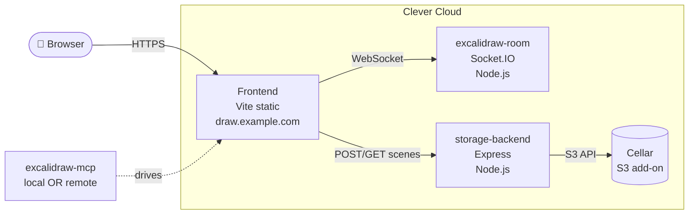

# Self-host Excalidraw on Clever Cloud

End-to-end guide to deploy your own Excalidraw stack — editor, real-time collaboration, scene storage, and MCP integration — on Clever Cloud.

Two deployment paths covered in parallel: `clever` CLI for hands-on learning, **and** Terraform for reproducibility.

## Architecture



Four Clever Cloud apps + one add-on:

| Component | Source                              | CC runtime    | Add-ons |
|-----------|-------------------------------------|---------------|---------|
| frontend  | fork of `excalidraw/excalidraw`     | static        | —       |
| room      | fork of `excalidraw/excalidraw-room`| Node.js       | —       |
| storage   | written here                        | Node.js       | Cellar  |
| mcp       | fork of `excalidraw/excalidraw-mcp` | Node.js (opt) | —       |

## Repo layout

```
clever_projects/excalidraw/
├── README.md
├── docs/                ← step-by-step guides
├── frontend/            ← clone of your fork (Phase 1)
├── room/                ← clone of your fork (Phase 3)
├── storage/             ← we build this (Phase 2)
├── mcp/                 ← clone of your fork (Phase 5)
└── terraform/           ← reproducible infra (Phase 6)
```

## Reading order

1. [Prerequisites](docs/00-prerequisites.md) — tools + accounts
2. [Fork & clone](docs/01-fork-and-clone.md) — repo strategy + upstream tracking
3. [Storage backend](docs/02-storage-backend.md) — custom Node + Cellar
4. [Collaboration room](docs/03-collaboration-room.md) — Socket.IO server
5. [Frontend](docs/04-frontend.md) — build + static deploy
6. [MCP server](docs/05-mcp-server.md) — comparison + integration
7. [Terraform](docs/06-terraform.md) — reproduce everything in HCL
8. [Updates & troubleshooting](docs/99-updates-troubleshooting.md) — pull upstream, verify

## Key idea before you start

Excalidraw encrypts scenes **end-to-end client-side**. Your storage backend never sees plaintext — it just stores opaque blobs. That's why our custom backend in Phase 2 is only ~50 lines of code: it's a thin proxy in front of Cellar (S3). No application logic, no schema, no DB.
