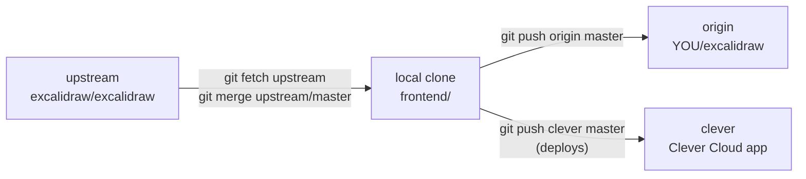

# 01 — Fork & clone

## Why fork instead of plain clone

A fork is **your own copy on GitHub**. With it you can:
- Push your customisations (build tweaks, branding, env defaults)
- Deploy via `git push clever master` from a branch *you* own
- Track upstream changes via a second remote

A plain clone has no remote of your own → no way to push your tweaks anywhere. Fork wins.



## Fork the three upstream repos

Via `gh`:
```sh
gh repo fork excalidraw/excalidraw           --clone=false
gh repo fork excalidraw/excalidraw-room      --clone=false
gh repo fork excalidraw/excalidraw-mcp       --clone=false
```

Or via the GitHub UI (Fork button on each repo). You should now have:
- `github.com/<YOU>/excalidraw`
- `github.com/<YOU>/excalidraw-room`
- `github.com/<YOU>/excalidraw-mcp`

## Clone your forks locally

```sh
cd ~/dev/lab/clever_projects/excalidraw

git clone git@github.com:<YOU>/excalidraw.git           frontend
git clone git@github.com:<YOU>/excalidraw-room.git      room
git clone git@github.com:<YOU>/excalidraw-mcp.git       mcp
```

Directories are renamed (`frontend`, `room`, `mcp`) to keep this project tidy.

## Track upstream on each fork

```sh
for d in frontend room mcp; do
  case "$d" in
    frontend) upstream="https://github.com/excalidraw/excalidraw.git" ;;
    room)     upstream="https://github.com/excalidraw/excalidraw-room.git" ;;
    mcp)      upstream="https://github.com/excalidraw/excalidraw-mcp.git" ;;
  esac
  git -C "$d" remote add upstream "$upstream"
  git -C "$d" remote -v
done
```

Pulling later (covered in [99 — Updates](99-updates-troubleshooting.md)):
```sh
cd frontend
git fetch upstream
git merge upstream/master       # or git rebase upstream/master
git push origin master
```

## Sanity check

```sh
ls -la ~/dev/lab/clever_projects/excalidraw/
# expect: README.md  docs/  frontend/  room/  mcp/
```

## Next

→ [02 — Storage backend](02-storage-backend.md)
