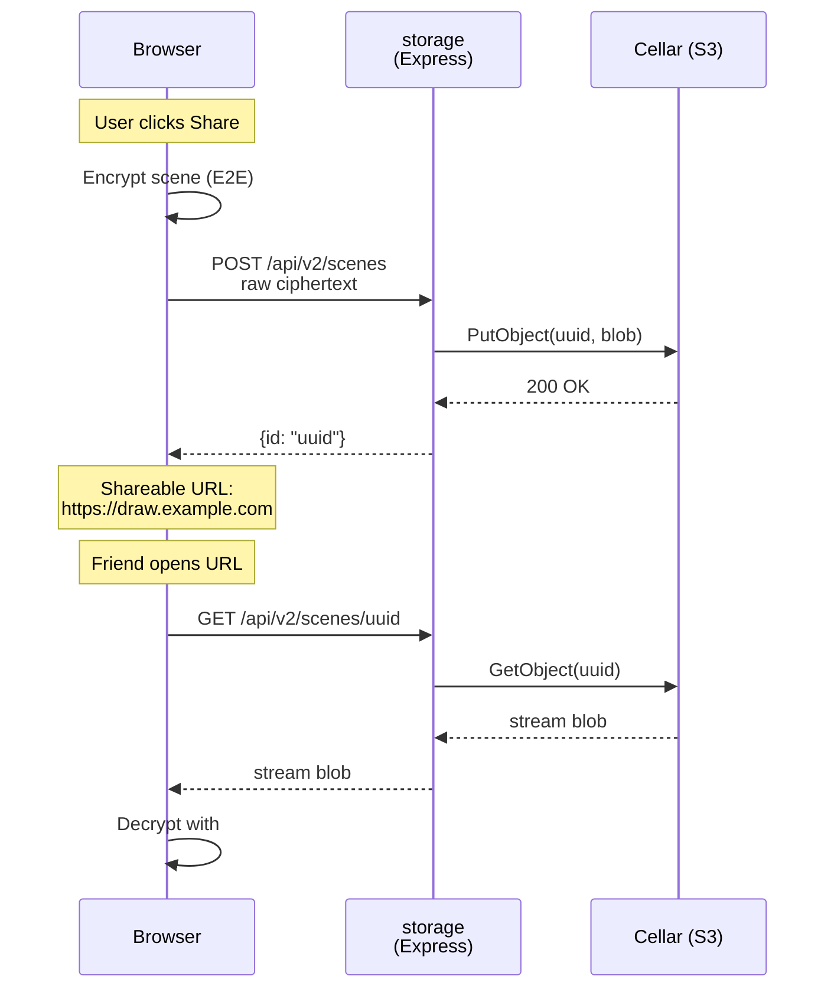

# 02 — Storage backend (custom Node + Cellar)

## What we're building

A ~50-line Express server that:
- `POST /api/v2/scenes` → stores opaque blob in Cellar, returns `{id}`
- `GET /api/v2/scenes/:id` → streams blob back
- handles CORS (frontend lives on a different vhost)
- exposes `/health`

Excalidraw E2E-encrypts the scene client-side, so the backend never sees plaintext. Zero schema, zero DB.



## Scaffold

```sh
cd ~/dev/lab/clever_projects/excalidraw
mkdir storage && cd storage
npm init -y
npm pkg set type="module"
npm pkg set scripts.start="node server.js"
npm pkg set engines.node=">=20"
npm install express cors @aws-sdk/client-s3
```

## `storage/server.js`

```js
import express from "express";
import cors from "cors";
import crypto from "node:crypto";
import { S3Client, PutObjectCommand, GetObjectCommand } from "@aws-sdk/client-s3";

const {
  CELLAR_ADDON_HOST,
  CELLAR_ADDON_KEY_ID,
  CELLAR_ADDON_KEY_SECRET,
  S3_BUCKET = "excalidraw-scenes",
  CORS_ORIGIN = "*",
  PORT = 8080,
} = process.env;

const s3 = new S3Client({
  endpoint: `https://${CELLAR_ADDON_HOST}`,
  region: "us-east-1",
  credentials: {
    accessKeyId: CELLAR_ADDON_KEY_ID,
    secretAccessKey: CELLAR_ADDON_KEY_SECRET,
  },
  forcePathStyle: true,
});

const app = express();
app.use(cors({ origin: CORS_ORIGIN }));
app.use(express.raw({ type: "*/*", limit: "20mb" }));

app.get("/health", (_req, res) => res.send("ok"));

app.post("/api/v2/scenes", async (req, res) => {
  const id = crypto.randomUUID();
  await s3.send(new PutObjectCommand({
    Bucket: S3_BUCKET,
    Key: id,
    Body: req.body,
    ContentType: "application/octet-stream",
  }));
  res.json({ id });
});

app.get("/api/v2/scenes/:id", async (req, res) => {
  try {
    const out = await s3.send(new GetObjectCommand({
      Bucket: S3_BUCKET,
      Key: req.params.id,
    }));
    res.set("Content-Type", "application/octet-stream");
    out.Body.pipe(res);
  } catch {
    res.status(404).end();
  }
});

app.listen(PORT, () => console.log(`storage on ${PORT}`));
```

## Deploy via `clever` CLI

```sh
cd storage
git init && git add . && git commit -m "init storage backend"

clever create --type node excalidraw-storage --region par
clever addon create cellar-addon excalidraw-cellar --plan S --region par
clever service link-addon excalidraw-cellar
clever env set S3_BUCKET excalidraw-scenes
clever env set CORS_ORIGIN "*"    # tighten later to your frontend domain

clever deploy
clever open
```

Linking the Cellar add-on auto-injects `CELLAR_ADDON_HOST/KEY_ID/KEY_SECRET` env vars into the app. No manual copy-paste.

## Create the bucket

Cellar is S3-compatible. Once the env vars exist, fetch them and create the bucket:

```sh
eval "$(clever env | grep CELLAR | sed 's/^/export /')"

aws --endpoint-url "https://$CELLAR_ADDON_HOST" \
    --region us-east-1 \
    s3 mb s3://excalidraw-scenes
```

## Verify

```sh
URL=$(clever open --print)         # or copy from `clever open`
curl -I "$URL/health"              # expect 200 OK
```

## Next

→ [03 — Collaboration room](03-collaboration-room.md)
