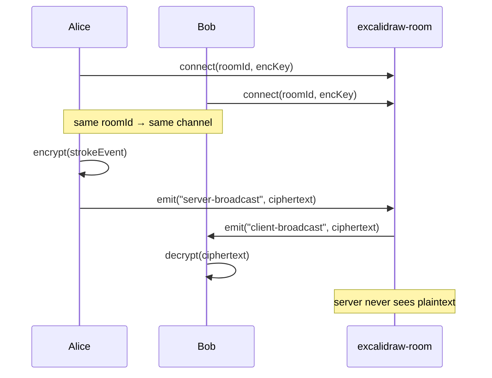

# 03 — Collaboration room (excalidraw-room)

## What it does

`excalidraw-room` is a thin Socket.IO server that relays encrypted events between clients connected to the same room ID. **Stateless**, no persistence. WebSocket only.



## Deploy via CLI

```sh
cd ~/dev/lab/clever_projects/excalidraw/room

clever create --type node excalidraw-room --region par
clever env set CORS_ALLOW_ORIGIN "*"    # tighten later to your frontend
clever deploy
clever open
```

Note the URL (e.g. `https://excalidraw-room.cleverapps.io`) — Phase 4 (frontend) needs it as `VITE_APP_WS_SERVER_URL`.

## WebSocket support on Clever Cloud

Enabled by default for Node.js runtime — no special config. Just don't forget the app must call `app.listen(process.env.PORT)`, which `excalidraw-room` already does.

## Verify

```sh
curl -sI "https://excalidraw-room.cleverapps.io/socket.io/?EIO=4&transport=polling"
# expect HTTP/2 200 (the handshake reply)
```

If you get 400, the server's alive but you sent a bad query — that's still a healthy sign.

## Next

→ [04 — Frontend](04-frontend.md)
