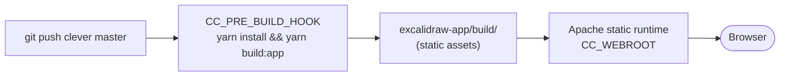

# 04 — Frontend

## What we're shipping

The Excalidraw editor itself — `frontend/excalidraw-app/` inside the monorepo. We build a static Vite bundle and serve it via Clever's static runtime.



## Wire it to your backends

Create `frontend/excalidraw-app/.env.production`:

```sh
VITE_APP_WS_SERVER_URL=https://excalidraw-room.cleverapps.io
VITE_APP_BACKEND_V2_GET_URL=https://excalidraw-storage.cleverapps.io/api/v2/scenes/
VITE_APP_BACKEND_V2_POST_URL=https://excalidraw-storage.cleverapps.io/api/v2/scenes

# Disable telemetry + Firebase (no keys → fallback off)
VITE_APP_DISABLE_TRACKING=true
```

Commit this file in your fork (it has no secrets, just public URLs):
```sh
cd frontend
git add excalidraw-app/.env.production
git commit -m "configure backends for self-hosted CC deploy"
git push origin master
```

## Deploy via CLI (static runtime)

```sh
cd frontend
clever create --type static-apache excalidraw-frontend --region par
clever env set CC_PRE_BUILD_HOOK "yarn install --frozen-lockfile && yarn build:app"
clever env set CC_WEBROOT "/excalidraw-app/build"
clever deploy
clever open
```

How this works:
- `CC_PRE_BUILD_HOOK` runs at build time (CC clones, then runs your hook)
- `CC_WEBROOT` tells Apache which directory to serve

## Custom domain

```sh
clever domain add draw.example.com
```

Then create a CNAME at your DNS provider:
```
draw.example.com.   CNAME   domain.par.clever-cloud.com.
```

Now tighten CORS on the other apps:
```sh
cd ../storage && clever env set CORS_ORIGIN "https://draw.example.com" && clever restart
cd ../room    && clever env set CORS_ALLOW_ORIGIN "https://draw.example.com" && clever restart
```

## Verify

Open `https://draw.example.com` in two browser windows. Click **+ Share** → **Start session**. The cursor + edits should sync live.

If something fails, see [99 — Troubleshooting](99-updates-troubleshooting.md).

## Next

→ [05 — MCP server](05-mcp-server.md)
