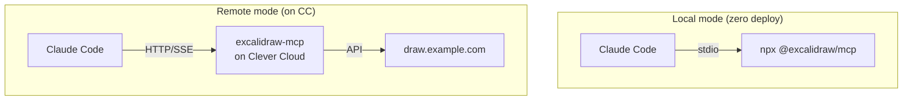

# 05 — MCP server

## Comparison (May 2026 ecosystem)

| Repo                                | Status        | Notes |
|-------------------------------------|---------------|-------|
| `excalidraw/excalidraw-mcp`         | **Official**  | New MCP App protocol, streamable, viewport control + fullscreen edit. Maintained by the Excalidraw team. |
| `yctimlin/mcp_excalidraw`           | Community     | Tool-style: agent gets a canvas API, real-time sync, can "see" what it drew. Strong tool-use semantics. |
| `Scofieldfree/excalidraw-mcp`       | Community     | Lightweight, create/edit/manage diagrams in conversation. |
| `lesleslie/excalidraw-mcp`          | Community     | Dual-language, live canvas. |
| `Fromsko/excalidraw-mcp-server`     | Community     | npx-distributed fork of yctimlin. |

**Recommendation:** start with the official `excalidraw/excalidraw-mcp`. Fall back to `yctimlin` if you need finer tool-style canvas APIs.

## Local vs remote



## Local mode (zero deploy)

Edit your Claude Code MCP config (depends on your client — for Claude Code itself, typically `~/.claude.json` or a project-scoped `.mcp.json`):

```json
{
  "mcpServers": {
    "excalidraw": {
      "command": "npx",
      "args": ["-y", "@excalidraw/mcp"]
    }
  }
}
```

Restart your client. The `excalidraw` tools should appear in the MCP server list.

## Remote mode (deployed on Clever Cloud)

If you want the MCP server reachable from any machine (multiple workstations, shared with teammates):

```sh
cd ~/dev/lab/clever_projects/excalidraw/mcp

# Check the README — confirm transport (stdio vs HTTP/SSE) before deploying.
# HTTP/SSE transport is required for remote use.

clever create --type node excalidraw-mcp --region par
clever env set EXCALIDRAW_BASE_URL "https://draw.example.com"
clever deploy
clever open
```

Then point your Claude Code config at the deployed HTTP/SSE endpoint — exact syntax depends on the server's transport implementation (check the official repo's README at the time you read this).

## Verify

In Claude Code:
```
/mcp
```
Look for `excalidraw` in the connected servers list, and try a tool call like "create an excalidraw diagram showing a 3-tier web architecture".

## Next

→ [06 — Terraform](06-terraform.md)
