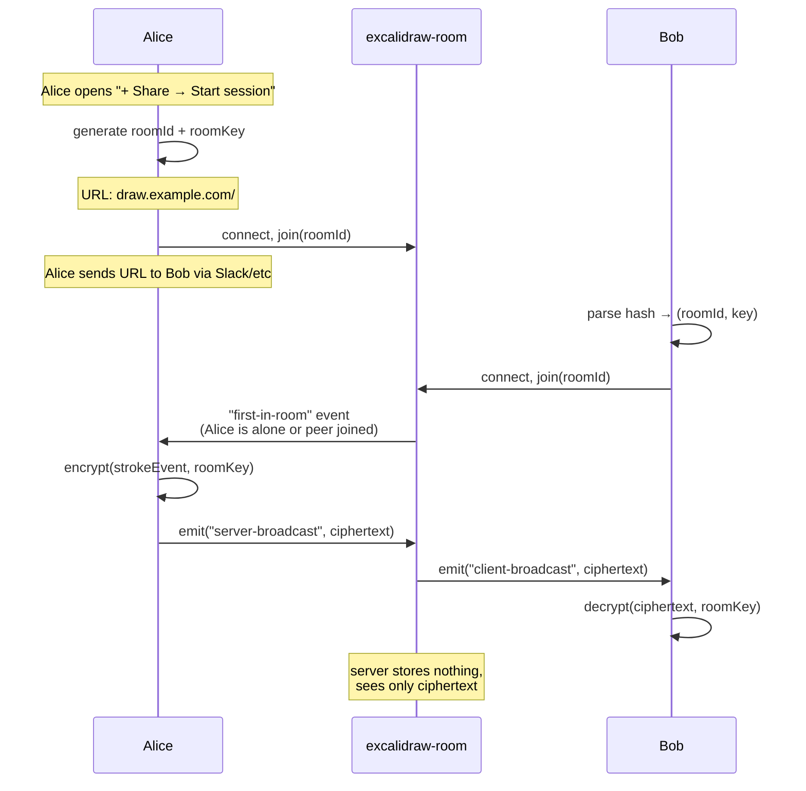

# Notion: Collaboration protocol

> Conceptual explanation of how Excalidraw's real-time collaboration works, the role of `excalidraw-room`, and what stays encrypted vs what's plaintext. Read this before following [`tutorials/03-collaboration-room.md`](../tutorials/03-collaboration-room.md).

## TL;DR

1. `excalidraw-room` is a **stateless Socket.IO relay** — it never persists data and never decrypts anything.
2. Each collab session has a **random room ID** + a **separate AES-GCM key**, both generated client-side. The key is shared via the URL fragment (never reaches the server).
3. The server's only job: forward events from one client to all others in the same room.
4. Same end-to-end-encryption pattern as the storage backend (see [`storage-backend.md`](storage-backend.md)), different transport (WebSocket instead of HTTP).

## Why a relay model

Real-time collaboration needs sub-second propagation of every stroke between every participant. Three architectural options exist:

| Approach | Verdict |
|----------|---------|
| Peer-to-peer (WebRTC) | NAT traversal pain, falls back to TURN servers anyway, fragile for N>2 |
| Polling | Latency too high for "I'm drawing right now" |
| **Central WebSocket relay** | The standard choice. Low latency, simple, scales horizontally |

Excalidraw picked relay via Socket.IO, which gives free fallbacks (WebSocket → long-polling → polling) for clients behind hostile networks.

## Why stateless matters

`excalidraw-room` does **not** persist user lists, scene state, room metadata, or anything else. Kill the server mid-session, restart it: clients reconnect, sync each other's local state, session resumes seamlessly.

This is deliberate, and it buys you two things:
1. **Operational simplicity**: no DB to manage, no migrations, no backup story. Restarts cost nothing.
2. **Privacy property**: there is literally no place where session content sits at rest on the server. Subpoena-proof in a sense that "we keep encrypted blobs for 30 days" backends aren't.

The trade-off: the server can't help a client that joins mid-session catch up — peer clients have to share their local scene. Acceptable for the use case.

## The flow

## Room ID and encryption key are separate secrets

Two distinct random values:
- **Room ID**: ~20-char base64 string. Server uses it as a Socket.IO room identifier — purely a routing token.
- **Room key**: separate AES-GCM key, base64-encoded. Never sent to the server.

URL format: `https://draw.example.com/#room=<roomId>,<base64key>`

Same `#` fragment trick as for shared scenes ([`storage-backend.md`](storage-backend.md) explains why): browser-only, never crosses HTTP.

The server knows the room ID (it has to — that's how it routes events). It does NOT know the key. If you compromise the server and dump all in-flight events to disk, you get a pile of ciphertext with the AES-GCM scheme between you and plaintext.

## Socket.IO events used

| Event                          | Direction       | Purpose |
|--------------------------------|-----------------|---------|
| `server-broadcast`             | client → server | Send a durable event to everyone in the room (server retries to slow clients) |
| `client-broadcast`             | server → client | The relayed version of the above |
| `server-volatile-broadcast`    | client → server | Like above but drop-on-the-floor for clients that can't keep up (used for cursor movements) |
| `client-volatile-broadcast`    | server → client | Relayed volatile |
| `first-in-room`                | server → client | "You're the only one here" — Excalidraw uses this to decide whether to wait for peers |
| `new-user`                     | server → client | A peer joined, sync your state to them |
| `room-user-change`             | server → client | The participant list changed |

The volatile vs durable split is a Socket.IO-native idea. Lets the app express "this matters, retry if needed" (a stroke that defines a shape) vs "this is just a frame, lose it" (mouse cursor pixel position 50 times per second). Without volatile, slow clients would back-pressure everyone.

## Implications for self-hosting

Since the server is stateless and a thin relay:

- **Horizontal scaling**: in principle yes, but you'd need **sticky sessions** because Socket.IO clients hold a long-lived connection. Either pin via load balancer affinity, or use a Socket.IO Redis adapter to share rooms across instances. For a personal/team deploy on Clever Cloud, 1 instance is plenty — a single Node process handles thousands of concurrent rooms.
- **Memory profile**: minimal. Each connected client uses a few KB. The bottleneck is open sockets per node (OS limit, raise `ulimit -n` if you hit it).
- **CPU profile**: trivial. The server doesn't decrypt or process events, it just forwards bytes.
- **CC defaults**: WebSocket support is on by default for Node.js apps. Nothing to configure beyond `app.listen(process.env.PORT)` (which `excalidraw-room` does out of the box).

## Comparing to the storage backend

| Property                  | storage-backend            | excalidraw-room               |
|---------------------------|----------------------------|-------------------------------|
| Transport                 | HTTP                       | WebSocket (Socket.IO)         |
| Persistence               | Cellar (S3 blobs)          | None                          |
| Encryption                | AES-GCM, client-side       | AES-GCM, client-side          |
| Key in URL fragment       | yes (`#json=id,key`)       | yes (`#room=id,key`)          |
| Auth                      | none                       | none                          |
| What server stores        | encrypted blobs            | nothing                       |
| Trust assumption          | "I trust the bucket"       | "I trust the relay process"   |

The two backends share the same threat model: assume the server is compromised, and the worst the attacker gets is opaque ciphertext or in-flight events they can't decrypt.

## Sources

- [`excalidraw/excalidraw-room` README](https://github.com/excalidraw/excalidraw-room) — what it is and how it's run
- [DeepWiki — Collaboration System](https://deepwiki.com/excalidraw/excalidraw/7-collaboration-system) — source-code-level walkthrough
- [DeepWiki — Backend Service Configuration](https://deepwiki.com/excalidraw/excalidraw/8.2-backend-service-configuration) — env var contract for swapping room URL
- [Socket.IO docs — Volatile events](https://socket.io/docs/v4/emitting-events/#volatile-events) — why the volatile channel exists
- [Excalidraw blog — End-to-End Encryption in the Browser](https://plus.excalidraw.com/blog/end-to-end-encryption) — also covers the collab E2E flow
