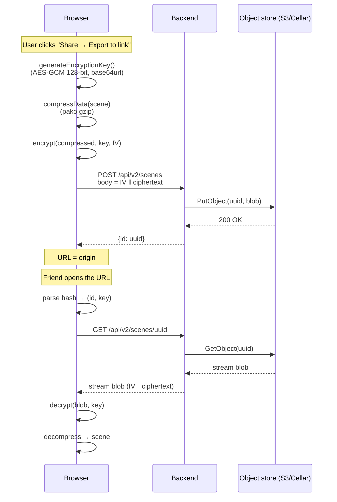

# Notion: Storage backend

> Conceptual explanation of how Excalidraw stores and shares scenes, and what that implies for any backend you build for it. Read this **before** following [`tutorials/02-storage-backend.md`](../tutorials/02-storage-backend.md) if you want to understand *why* the implementation is so small.

## TL;DR

1. Excalidraw scenes shared via link are **encrypted client-side** with AES-GCM before being sent anywhere.
2. The decryption key never leaves the browser — it's stored in the **URL fragment** (after `#`), which by HTTP spec is never sent to the server.
3. The storage backend therefore handles **opaque ciphertext blobs only**. It has no schema, no auth, no permissions to enforce.
4. Two endpoints are enough: `POST /api/v2/scenes` (write) and `GET /api/v2/scenes/:id` (read). That's why a self-hosted backend fits in ~50 lines of Node.

## Why this matters before you implement

Most "save & share" features in web apps need auth, schemas, ACLs, audit logging, GDPR data flows. Excalidraw needs **none** of that for shared scenes — the client encrypts before sending, so the server can't read content even if it wanted to. The server is a dumb blob store.

Forgetting this and "improving" the backend (adding user accounts, content moderation, search indexing) immediately breaks the security model: you'd need plaintext on the server to make any of that work, and at that point you're a normal SaaS with all the corresponding obligations.

## The flow

## Why the URL fragment is the secret channel

A URL like `https://draw.example.com/#json=abc123,XYZ_base64_key`:
- The **path** (`/`) and **query string** (after `?`) are sent in the HTTP request line — server sees them, logs them, proxies log them.
- The **fragment** (after `#`) is browser-only by HTTP spec ([RFC 3986 §3.5](https://datatracker.ietf.org/doc/html/rfc3986#section-3.5)). The browser strips it before making the request and only JavaScript on the page can read it via `window.location.hash`.

So the encryption key lives in a part of the URL that:
- Travels with copy-paste / messaging apps (it's part of the URL string)
- Never appears in your server access logs
- Never reaches CDNs, reverse proxies, or any analytics tool watching network requests

This is the same trick used by password reset links and a few end-to-end-encrypted SaaS tools.

## API contract

The frontend reads two env vars at build time:
- `VITE_APP_BACKEND_V2_POST_URL` → POST endpoint (returns `{id}`)
- `VITE_APP_BACKEND_V2_GET_URL`  → GET prefix (frontend appends `:id`)

Minimum contract your backend must honor:

| Method | Path                       | Request body         | Response                       |
|--------|----------------------------|----------------------|--------------------------------|
| POST   | `/api/v2/scenes`           | opaque bytes (≤ ~10 MB) | `{ id: string }` (JSON)        |
| GET    | `/api/v2/scenes/:id`       | —                    | opaque bytes (same as posted), or 404 |

CORS headers must allow the frontend's origin (`Access-Control-Allow-Origin`).

> **Files (binary assets) are a separate endpoint pair** (`/api/v2/files`). For shared scenes used solo, you can skip files entirely — images embed as base64 in the scene blob. For collaborative sessions with images, you'd implement the same shape for `/api/v2/files/:id`, again storing opaque blobs.

## What the backend must NOT do

- **Auth**: the `id` is the only handle. Without the key (which the server never sees), the blob is useless. Adding "login required" gates nothing security-wise.
- **Schema validation**: blobs are encrypted bytes — any byte sequence is valid. Trying to validate JSON server-side will fail on every request.
- **Server-side rendering / thumbnails**: impossible without the key. If you need previews, generate them client-side and upload alongside the scene (and accept they'll also be opaque).
- **Per-user "my scenes" listing**: the server has no notion of who wrote what, by design. Cookie-based session would let you list IDs a user posted, but you still can't decrypt their content.

## When this model breaks down

If your requirements grow beyond "I want a working share link":

| Requirement                                  | Implication |
|----------------------------------------------|-------------|
| Per-user quotas / billing                    | Need an auth layer wrapping the blob store (cookies, OAuth, etc.) |
| Content moderation                           | Impossible without plaintext → would require breaking E2E or moving to client-side reporting |
| GDPR right-to-erasure                        | Easy if you scope blobs by user (each user can delete their own blobs); requires the auth layer |
| Search / discovery                           | Impossible. Excalidraw+ (commercial) handles this by **not** using E2E for org workspaces |
| Versioned history of a scene                 | Store multiple blobs under `{sceneId}/v{n}`. Still opaque. |

That's why Excalidraw's commercial Plus offering uses a different architecture for workspaces — E2E is great for ad-hoc shares but trades off org features. Worth knowing if you build on top of this.

## Encryption details (for the curious)

- **Algorithm**: AES-GCM via Web Crypto API (`crypto.subtle.encrypt`)
- **Key size**: 128 bits — defined in [`packages/excalidraw/data/encryption.ts`](https://github.com/excalidraw/excalidraw/blob/master/packages/excalidraw/data/encryption.ts) as `ENCRYPTION_KEY_BITS`
- **Key serialization**: base64url, ~22 chars
- **IV**: 12 random bytes per encryption, prepended to the ciphertext in the stored blob
- **Pre-encryption pipeline**: `JSON.stringify → pako.gzip → encrypt`. Compression matters because GZIP'd Excalidraw JSON is often 10-20× smaller than raw.
- **For collab sessions**: same AES-GCM, but the key is shared via the room URL fragment instead and the WebSocket server (excalidraw-room) relays already-encrypted events. See [`notions/collaboration-protocol.md`] *(not yet written)*.

## Sources (upstream)

- [Excalidraw blog — End-to-End Encryption in the Browser](https://plus.excalidraw.com/blog/end-to-end-encryption) — the canonical explainer from the team
- [Excalidraw Security & Compliance](https://plus.excalidraw.com/security-and-compliance) — what they actually guarantee
- [DeepWiki — Backend Service Configuration](https://deepwiki.com/excalidraw/excalidraw/8.2-backend-service-configuration) — env var contract for swapping backends
- [DeepWiki — Backend Integration and Share Links](https://deepwiki.com/excalidraw/excalidraw/6.7-export-system) — the POST/GET flow in source code
- [DeepWiki — Collaboration System](https://deepwiki.com/excalidraw/excalidraw/7-collaboration-system) — companion protocol for live sessions
- [Excalidraw source — `data/encryption.ts`](https://github.com/excalidraw/excalidraw/blob/master/packages/excalidraw/data/encryption.ts) — the actual encryption primitives
- [RFC 3986 §3.5 — URI fragment identifier](https://datatracker.ietf.org/doc/html/rfc3986#section-3.5) — why the hash never reaches the server
