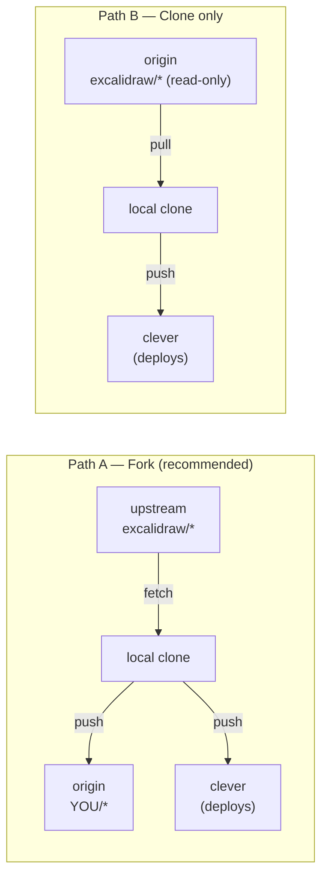

# 01 — Fork & clone

## Choose your path

Two valid approaches depending on whether you plan to customise:

| Criterion                          | Path A: **Fork**          | Path B: **Read-only clone** |
|------------------------------------|---------------------------|------------------------------|
| Need to tweak env / branding / etc | ✅ goes to a remote *you* own | ⚠️ stays local or only on `clever` remote |
| Pull upstream updates              | `git fetch upstream`      | `git pull` (origin = upstream) |
| Backup of your changes off CC      | ✅ GitHub fork is the backup | ❌ only on your laptop + CC |
| GitHub account required            | ✅                        | ❌                           |
| Number of remotes per clone        | 3 (`origin` + `upstream` + `clever`) | 2 (`origin` + `clever`) |



**Quick rule of thumb**: if you're just here to spin up your instance and read the docs, **Path B** is enough. If you're going to commit anything (env vars, branding, customisations), go **Path A** — you'll be glad you did the day you reinstall your laptop.

> The frontend needs build-time env vars. With Path B, you'll commit `.env.production` locally and push only to `clever` (no upstream backup). With Path A, those changes live on your fork too. Storage and room don't need code changes at all, so both paths work fine for them.

## Where to put the clones

Anywhere you prefer — the tutorial uses bare directory names (`frontend/`, `room/`) so it stays portable. Two common conventions:

- **Alongside this tutorial repo** — simplest, everything in one folder.
- **In a dedicated OSS-forks workspace** (e.g. `~/dev/contribution/`, `~/code/forks/`) — keeps upstream forks separated from your own projects. Use symlinks (`ln -s ~/dev/contribution/excalidraw ./frontend`) if you still want `cd frontend && clever deploy` ergonomics from the tutorial dir.

Pick one and `cd` there before running the clone commands below.

## Path A — Fork (recommended)

### Fork the two upstream repos

Via `gh`:
```sh
gh repo fork excalidraw/excalidraw           --clone=false
gh repo fork excalidraw/excalidraw-room      --clone=false
```

Or via the GitHub UI (Fork button on each repo). You should now have:
- `github.com/<YOU>/excalidraw`
- `github.com/<YOU>/excalidraw-room`

### Clone your forks locally

From your chosen workspace dir:

```sh
git clone git@github.com:<YOU>/excalidraw.git           frontend
git clone git@github.com:<YOU>/excalidraw-room.git      room
```

Directories are renamed (`frontend`, `room`) so the rest of the tutorial can reference them by short, predictable names.

### Track upstream on each fork

```sh
for d in frontend room; do
  case "$d" in
    frontend) upstream="https://github.com/excalidraw/excalidraw.git" ;;
    room)     upstream="https://github.com/excalidraw/excalidraw-room.git" ;;
  esac
  git -C "$d" remote add upstream "$upstream"
  git -C "$d" remote -v
done
```

Pulling later (covered in [99 — Updates](99-updates-troubleshooting.md)):
```sh
cd frontend
git fetch upstream
git merge upstream/master       # or git rebase upstream/master
git push origin master
```

## Path B — Read-only clone (no fork)

Skip GitHub entirely. Useful if you want a strictly read-only mirror of upstream and only deploy to Clever Cloud.

### Clone upstream directly

From your chosen workspace dir:

```sh
git clone https://github.com/excalidraw/excalidraw.git           frontend
git clone https://github.com/excalidraw/excalidraw-room.git      room
```

Here `origin` **is** the upstream repo. Updates are a plain:
```sh
cd frontend
git pull origin master
```

### Important: you can't `git push origin`

You don't own `excalidraw/excalidraw`, so any commit you make stays on your machine until you push it to `clever` (set up later in each phase). That's fine for the runtime — Clever Cloud doesn't care where you push from, as long as it gets the code.

If you change your mind later and want to fork, it's lossless:
```sh
gh repo fork --remote --remote-name origin    # GitHub fork is created, your local `origin` is repointed
git push origin master                         # your local commits now go up to your fork
```

## Sanity check (both paths)

From your workspace dir:

```sh
ls
# expect at minimum: frontend  room  (alongside whatever else you have)

for d in frontend room; do
  echo "--- $d ---"
  git -C "$d" remote -v
done
# Path A: each shows origin (your fork) + upstream (excalidraw/*)
# Path B: each shows only origin (excalidraw/*)
```

## Why not git submodules?

A natural reflex when you see a repo that "depends on" two other repos is to reach for submodules. Don't, for this stack — the cost outweighs the benefit. Quick rationale:

| Criterion                                       | Submodules win | Our setup |
|-------------------------------------------------|----------------|-----------|
| Parent project *builds/embeds* the sub-repo     | yes            | ❌ each fork is its own deployable CC app |
| Lifecycle must stay synchronous                 | yes            | ❌ you can pull upstream in `frontend/` without touching the tutorial |
| Single `git clone --recurse-submodules` must reproduce the whole stack | yes | ❌ readers may want to fork only one of the three |
| Pinned version of sub-repo is critical          | yes            | ⚠️ a `# tested with sha=...` line in the doc covers this |

Concrete operational pain if you forced submodules here: each fork would default to *detached HEAD* (the parent pins it at a specific SHA, not a branch). To run `git push clever master` you'd have to checkout master inside the submodule first, which desynchronises the parent's pointer. Every upstream merge becomes `cd submodule && fetch && merge && cd .. && git add submodule && git commit "bump"` — ceremony for zero benefit when the deployment unit is the submodule itself.

The real "submodule relation" already exists via GitHub: `excalidraw/excalidraw` (upstream) ↔ `<YOU>/excalidraw` (fork) ↔ local clone. GitHub manages the fork-tracking relationship, your `upstream` remote handles updates. Adding a fourth layer (parent repo pinning a fork commit) duplicates this without value.

**When it would make sense**: if you later add an E2E test that boots all components locally and needs deterministic versions for reproducible CI, a thin "test harness" repo with submodule pins would be appropriate. We're not there.

## Next

→ [02 — Storage backend](02-storage-backend.md)
