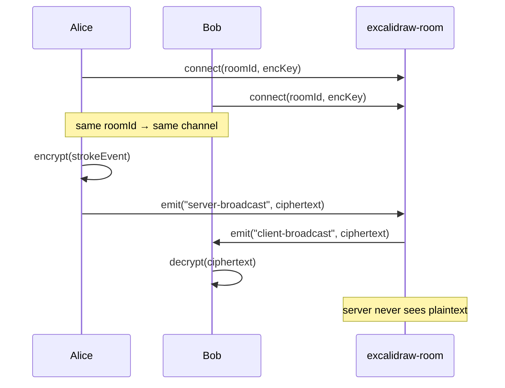

# 03 — Collaboration room (excalidraw-room)

> 📖 **Background**: [`notions/collaboration-protocol.md`](../notions/collaboration-protocol.md) explains *why* the relay can be stateless and how the E2E encryption works for live sessions. Read it first if you want to understand the protocol — the deploy below is trivial precisely because the server has no logic of its own.

## What it does

`excalidraw-room` is a thin Socket.IO server that relays encrypted events between clients connected to the same room ID. **Stateless**, no persistence. WebSocket only.



## Deploy via CLI

From the `room/` clone:

```sh
cd room

clever create --type node excalidraw.room --region par
clever env set CC_POST_BUILD_HOOK "yarn build"   # see callout below
clever env set CORS_ALLOW_ORIGIN "*"             # tighten later in tutorial 04
clever deploy
```

Get the URL for the next tutorial:

```sh
URL="https://$(clever domain | head -n1 | tr -d ' /')"
echo "$URL"
# → https://app-xxxxxxxx-xxxx-xxxx-xxxx-xxxxxxxxxxxx.cleverapps.io
```

You'll need this hostname in tutorial 04 as `VITE_APP_WS_SERVER_URL`.

> ⚠️ Without `CC_POST_BUILD_HOOK="yarn build"`, the deploy crashes at startup with `Cannot find module .../dist/index.js` — `excalidraw-room` is TypeScript and has no `postinstall` hook. See [Clever Cloud — Node.js runtime](https://www.clever.cloud/developers/doc/applications/javascript/nodejs/) for the build lifecycle.

## WebSocket support on Clever Cloud

Enabled by default for Node.js runtime — no special config. Just don't forget the app must call `app.listen(process.env.PORT)`, which `excalidraw-room` already does.

## Verify

```sh
URL="https://$(clever domain | head -n1 | tr -d ' /')"

# Socket.IO polling handshake — expect HTTP/2 200
curl -sI "$URL/socket.io/?EIO=4&transport=polling"
```

A 400 means the server is alive but you sent a malformed query — still a healthy sign. If you get 502/503 or "MODULE_NOT_FOUND" in logs:

```sh
clever logs --since 5m | tail -50
```

Look for `MODULE_NOT_FOUND` (build never ran) or `EADDRINUSE` (PORT misconfigured).

## Next

→ [04 — Frontend](04-frontend.md)
