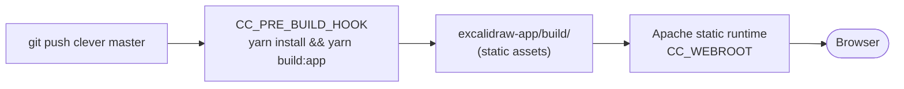

# 04 — Frontend

> 📖 **Background**: [`notions/frontend-build-and-env.md`](../notions/frontend-build-and-env.md) explains *why* Vite env vars are build-time (deploy = rebuild), why we pick the static-apache runtime over Node, and what `CC_PRE_BUILD_HOOK` / `CC_WEBROOT` actually do. Read it first to avoid the classic "I changed the env var but nothing happened" confusion.

## What we're shipping

The Excalidraw editor itself — `frontend/excalidraw-app/` inside the monorepo. We build a static Vite bundle and serve it via Clever's static runtime.



## Wire it to your backends

From the workspace dir (where `frontend/`, `room/`, `storage/` live), generate `frontend/excalidraw-app/.env.production` directly from `clever domain`:

```sh
ROOM_URL="https://$(cd room && clever domain | head -n1 | tr -d ' /')"
STORAGE_URL="https://$(cd storage && clever domain | head -n1 | tr -d ' /')"

cat > frontend/excalidraw-app/.env.production <<EOF
VITE_APP_WS_SERVER_URL=$ROOM_URL
VITE_APP_BACKEND_V2_GET_URL=$STORAGE_URL/api/v2/scenes/
VITE_APP_BACKEND_V2_POST_URL=$STORAGE_URL/api/v2/scenes

VITE_APP_DISABLE_TRACKING=true
EOF

cat frontend/excalidraw-app/.env.production   # verify
```

> If you set up custom domains later (`clever domain add draw.example.com`), replace these `cleverapps.io` URLs with your custom ones and redeploy.

Commit the file in your fork (no secrets, just public URLs):

```sh
cd frontend
git add excalidraw-app/.env.production
git commit -m "configure backends for self-hosted CC deploy"
git push origin master
```

## Deploy via CLI (static runtime)

```sh
cd frontend
clever create --type static-apache excalidraw.frontend --region par
clever env set CC_PRE_BUILD_HOOK "yarn install --frozen-lockfile && yarn build:app"
clever env set CC_WEBROOT "/excalidraw-app/build"
clever scale --build-flavor M   # see callout
clever deploy
```

How this works:
- `CC_PRE_BUILD_HOOK` runs at build time (CC clones, then runs your hook)
- `CC_WEBROOT` tells Apache which directory to serve

> ⚠️ Excalidraw's Vite build OOMs on the default XS build instance (the React+radix-ui graph is heavy). `clever scale --build-flavor M` uses a dedicated 4 GB instance only during the build; the runtime stays on XS. See [Clever Cloud — Dedicated build instances](https://www.clever.cloud/developers/doc/develop/build-instances/).

## Custom domain (optional)

The default URL `https://app-<uuid>.cleverapps.io` works as-is — skip this section if you don't care about a prettier URL.

If you **own a domain** (e.g. `draw.example.com`):
```sh
clever domain add draw.example.com
```
Create a CNAME at your DNS provider:
```
draw.example.com.   CNAME   domain.par.clever-cloud.com.
```

If you **don't own a domain**, claim a free `*.cleverapps.io` subdomain (any name still available):
```sh
clever domain add excalidraw-frontend.cleverapps.io   # single-level, hyphen — see below
```

> ⚠️ **Use a single-level subdomain only**. The Clever Cloud wildcard cert covers `*.cleverapps.io` (one level). A two-level name like `excalidraw.frontend.cleverapps.io` has **no valid TLS cert** — the browser falls back to HTTP, and Excalidraw breaks immediately on `window.crypto.subtle is undefined` (E2E encryption requires a secure context). Always use `<name>-<more>.cleverapps.io` with hyphens, not dots.

## Tighten CORS

Get the frontend's final URL (custom if you added one, otherwise the default `app-<uuid>` one):
```sh
FRONTEND_URL="https://$(clever domain | head -n1 | tr -d ' /')"
echo "$FRONTEND_URL"
```

Restrict the backends to accept requests only from this origin:
```sh
cd ../storage && clever env set CORS_ORIGIN "$FRONTEND_URL" && clever restart
cd ../room    && clever env set CORS_ALLOW_ORIGIN "$FRONTEND_URL" && clever restart
```

## Verify

Open `https://draw.example.com` in two browser windows. Click **+ Share** → **Start session**. The cursor + edits should sync live.

If something fails, see [99 — Troubleshooting](99-updates-troubleshooting.md).

## Next

→ [05 — Terraform](05-terraform.md)
