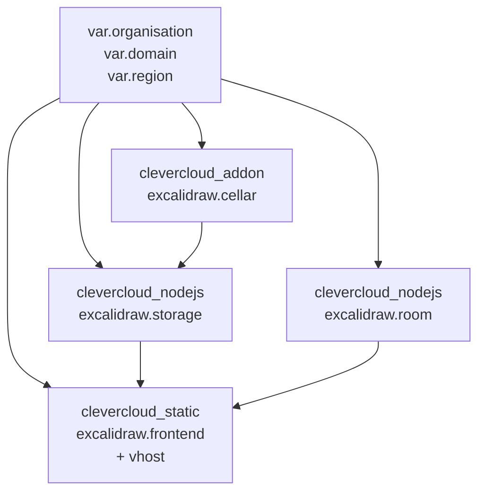

# 05 — Terraform (reproducible infra)

> 📖 **Background**: [`notions/terraform-on-clevercloud.md`](../notions/terraform-on-clevercloud.md) explains the provider's auth model, the deliberate "infra vs code shipping" split, the `dependencies` attribute, and how to use Cellar as a remote backend for TF state itself. Read it first to know what Terraform manages here and (importantly) what it does NOT.

Goal: replace the manual `clever create / env set / deploy` with declarative HCL. Terraform provisions the apps + add-ons; `git push clever master` still ships the code.

## Resource dependency graph



## File layout

```
terraform/
├── main.tf            # provider + version pin
├── variables.tf
├── terraform.tfvars   # gitignored
├── cellar.tf
├── storage.tf
├── room.tf
├── frontend.tf
└── outputs.tf
```

## `main.tf`

```hcl
terraform {
  required_version = ">= 1.5"
  required_providers {
    clevercloud = {
      source  = "CleverCloud/clevercloud"
      version = "~> 1.11"
    }
  }
}

provider "clevercloud" {
  organisation = var.organisation
  # token + secret read from env: CC_OAUTH_TOKEN, CC_OAUTH_SECRET
}
```

## `variables.tf`

```hcl
variable "organisation" {
  type        = string
  description = "CC org or user ID (user_xxxxxxxx-xxxx-xxxx-xxxx-xxxxxxxxxxxx)"
}

variable "region" {
  type    = string
  default = "par"
}

variable "domain" {
  type        = string
  description = "Public hostname for the frontend, e.g. draw.example.com"
}
```

## `terraform.tfvars` (gitignored)

```hcl
organisation = "user_xxxxxxxx-xxxx-xxxx-xxxx-xxxxxxxxxxxx"   # your CC org or user ID
domain       = "draw.example.com"
```

## `cellar.tf`

```hcl
resource "clevercloud_addon" "cellar" {
  name        = "excalidraw.cellar"
  provider_id = "cellar-addon"
  plan        = "S"
  region      = var.region
}
```

## `storage.tf`

```hcl
resource "clevercloud_nodejs" "storage" {
  name               = "excalidraw.storage"
  region             = var.region
  min_instance_count = 1
  max_instance_count = 4
  smallest_flavor    = "pico"
  biggest_flavor     = "M"

  environment = {
    S3_BUCKET   = "excalidraw-scenes"
    CORS_ORIGIN = "https://${var.domain}"
  }

  dependencies = [clevercloud_addon.cellar.id]
}
```

## `room.tf`

```hcl
resource "clevercloud_nodejs" "room" {
  name               = "excalidraw.room"
  region             = var.region
  min_instance_count = 1
  max_instance_count = 4
  smallest_flavor    = "pico"
  biggest_flavor     = "M"
  sticky_sessions    = true   # WebSocket clients must stick to one instance

  environment = {
    CORS_ALLOW_ORIGIN = "https://${var.domain}"
  }
}
```

## `frontend.tf`

```hcl
resource "clevercloud_static" "frontend" {
  name               = "excalidraw.frontend"
  region             = var.region
  min_instance_count = 1
  max_instance_count = 4
  smallest_flavor    = "nano"  # static-apache doesn't accept "pico" — smallest valid is "nano"
  biggest_flavor     = "M"

  environment = {
    CC_PRE_BUILD_HOOK            = "yarn install --frozen-lockfile && yarn build:app"
    CC_WEBROOT                   = "/excalidraw-app/build"
    VITE_APP_WS_SERVER_URL       = "https://${clevercloud_nodejs.room.vhost}"
    VITE_APP_BACKEND_V2_GET_URL  = "https://${clevercloud_nodejs.storage.vhost}/api/v2/scenes/"
    VITE_APP_BACKEND_V2_POST_URL = "https://${clevercloud_nodejs.storage.vhost}/api/v2/scenes"
  }

  additional_vhosts = [var.domain]
}
```

> Note: exact attribute names (`vhost`, `additional_vhosts`, `dependencies`) may shift between provider versions. Always cross-check with the [registry docs](https://registry.terraform.io/providers/CleverCloud/clevercloud/latest/docs) for `~> 1.11`.

## `outputs.tf`

```hcl
output "frontend_url"  { value = "https://${var.domain}" }
output "room_url"      { value = "https://${clevercloud_nodejs.room.vhost}" }
output "storage_url"   { value = "https://${clevercloud_nodejs.storage.vhost}" }
output "cellar_bucket" { value = "excalidraw-scenes" }

output "storage_git_url"  { value = clevercloud_nodejs.storage.deploy_url }
output "room_git_url"     { value = clevercloud_nodejs.room.deploy_url }
output "frontend_git_url" { value = clevercloud_static.frontend.deploy_url }
```

## Apply

```sh
cd terraform
export CC_OAUTH_TOKEN="..."
export CC_OAUTH_SECRET="..."

terraform init
terraform plan
terraform apply
```

## Push code to the apps Terraform created

Terraform builds the apps but doesn't push your code. Wire the `clever` git remote per app, using the outputs:

```sh
cd ../storage
git remote add clever "$(terraform -chdir=../terraform output -raw storage_git_url)"
git push clever master

cd ../room
git remote add clever "$(terraform -chdir=../terraform output -raw room_git_url)"
git push clever master

cd ../frontend
git remote add clever "$(terraform -chdir=../terraform output -raw frontend_git_url)"
git push clever master
```

## Don't forget `.gitignore`

In `terraform/.gitignore`:
```
.terraform/
*.tfstate*
terraform.tfvars
.terraform.lock.hcl
```

For shared use, swap the local state for a remote backend (Cellar can host TF state via the S3 backend).

## Next

→ [99 — Updates & troubleshooting](99-updates-troubleshooting.md)
